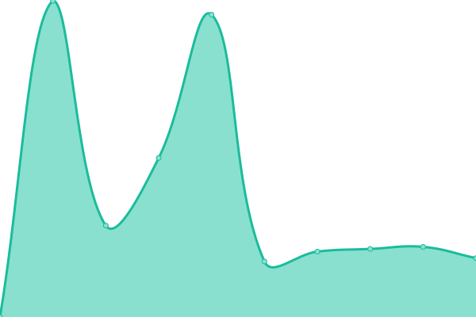

# [📈 Live Status](https://stupidman89.github.io/awesome-uptime): <!--live status--> **🟩 All systems operational**

This repository contains the open-source uptime monitor and status page for [stupidman89](https://stupidman89.github.io/awesome-uptime), powered by [Upptime](https://github.com/upptime/upptime).

With [Upptime](https://upptime.js.org), you can get your own unlimited and free uptime monitor and status page, powered entirely by a GitHub repository. We use [Issues](https://github.com/stupidman89/awesome-uptime/issues) as incident reports, [Actions](https://github.com/stupidman89/awesome-uptime/actions) as uptime monitors, and [Pages](https://stupidman89.github.io/awesome-uptime) for the status page.

<!--start: status pages-->
<!-- This summary is generated by Upptime (https://github.com/upptime/upptime) -->
<!-- Do not edit this manually, your changes will be overwritten -->
<!-- prettier-ignore -->
| URL | Status | History | Response Time | Uptime |
| --- | ------ | ------- | ------------- | ------ |
|  [sipraja](https://sipraja.sidoarjokab.go.id) | 🟩 Up | [sipraja.yml](https://github.com/stupidman89/awesome-uptime/commits/HEAD/history/sipraja.yml) | 

 1822ms
     
 | 

<a href="https://stupidman89.github.io/awesome-uptime/history/sipraja">100.00%</a>
    

|  [Wikipedia](https://en.wikipedia.org) | 🟩 Up | [wikipedia.yml](https://github.com/stupidman89/awesome-uptime/commits/HEAD/history/wikipedia.yml) | 

 188ms
     
 | 

<a href="https://stupidman89.github.io/awesome-uptime/history/wikipedia">100.00%</a>
    

|  [e-buddy](https://e-buddy.sidoarjokab.go.id) | 🟩 Up | [e-buddy.yml](https://github.com/stupidman89/awesome-uptime/commits/HEAD/history/e-buddy.yml) | 

 1600ms
     
 | 

<a href="https://stupidman89.github.io/awesome-uptime/history/e-buddy">100.00%</a>
    

|  [sidoarjokab.go.id](https://sidoarjokab.go.id) | 🟩 Up | [sidoarjokab-go-id.yml](https://github.com/stupidman89/awesome-uptime/commits/HEAD/history/sidoarjokab-go-id.yml) | 

 1671ms
     
 | 

<a href="https://stupidman89.github.io/awesome-uptime/history/sidoarjokab-go-id">100.00%</a>
    

|  [siksda](https://siksda.sidoarjokab.go.id) | 🟩 Up | [siksda.yml](https://github.com/stupidman89/awesome-uptime/commits/HEAD/history/siksda.yml) | 

 1063ms
     
 | 

<a href="https://stupidman89.github.io/awesome-uptime/history/siksda">99.73%</a>
    

|  [skp](http://skp2020.sidoarjokab.go.id) | 🟩 Up | [skp.yml](https://github.com/stupidman89/awesome-uptime/commits/HEAD/history/skp.yml) | 

 1789ms
     
 | 

<a href="https://stupidman89.github.io/awesome-uptime/history/skp">100.00%</a>
    

|  [e-kinerja](http://e-kinerja.sidoarjokab.go.id) | 🟩 Up | [e-kinerja.yml](https://github.com/stupidman89/awesome-uptime/commits/HEAD/history/e-kinerja.yml) | 

 1509ms
     
 | 

<a href="https://stupidman89.github.io/awesome-uptime/history/e-kinerja">100.00%</a>
    

|  [bos](https://bos.sidoarjokab.go.id) | 🟩 Up | [bos.yml](https://github.com/stupidman89/awesome-uptime/commits/HEAD/history/bos.yml) | 

 1409ms
     
 | 

<a href="https://stupidman89.github.io/awesome-uptime/history/bos">100.00%</a>
    

<!--end: status pages-->

[**Visit our status website →**](https://stupidman89.github.io/awesome-uptime)

## 📄 License

- Powered by: [Upptime](https://github.com/upptime/upptime)
- Code: [MIT](./LICENSE) © [stupidman89](https://stupidman89.github.io/awesome-uptime)
- Data in the `./history` directory: [Open Database License](https://opendatacommons.org/licenses/odbl/1-0/)
